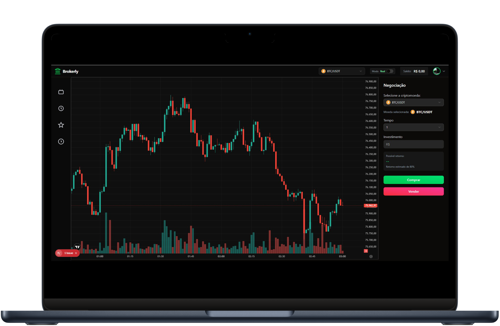

<h1 align="center">
  <br/>
  🖤 Broker Black Pearl
  <br/>
  <sub>Plataforma de Trading de Opções Binárias</sub>
</h1>

<p align="center">
  
  
  
</p>

---

## 📋 Visão Geral do Projeto

**Broker Black Pearl** é uma plataforma proprietária de trading de **opções binárias baseada em ativos reais do mercado financeiro**. O sistema permite que usuários realizem operações de curto prazo apostando na direção de preços de pares de criptomoedas e ativos financeiros em tempo real, com dados alimentados diretamente pela exchange Binance.

| Atributo | Descrição |
|---|---|
| **Tipo de Sistema** | Plataforma SaaS B2C de Trading Financeiro |
| **Modelo de Negócio** | Corretora de Opções Binárias com programa de afiliados |
| **Ambiente de Produção** | [brokerblackpearl.com.br](https://brokerblackpearl.com.br) |
| **Arquitetura** | Full Stack — Backend + Frontend em containers isolados |

---

## 🎯 Contexto de Negócio

### O Problema

O mercado de plataformas de trading no Brasil carecia de soluções **completamente customizáveis**, onde o operador do negócio tivesse controle total sobre os parâmetros financeiros da plataforma — desde o percentual de ganho por operação até a configuração do gateway de pagamento, tudo via painel administrativo, sem necessidade de acesso técnico ao código.

As alternativas existentes no mercado eram predominantemente baseadas em **white-labels estrangeiros**, com limitações severas de personalização, custos elevados de licenciamento e nenhuma adaptação ao ecossistema de pagamentos brasileiro (PIX).

### Perfil do Cliente

O sistema foi desenvolvido para **operadores de corretora** que desejam lançar e gerenciar sua própria plataforma de trading com:

- Controle total sobre os parâmetros operacionais (payout, limites de transação)
- Integração nativa com meios de pagamento brasileiros (PIX via gateway)
- Programa de afiliados próprio para aquisição de usuários
- Dashboard administrativo unificado para gestão de contas, operações e financeiro

### Situação Anterior à Implementação

Antes desta solução, o operador dependia de plataformas de terceiros que:

- Cobrava royalties sobre o volume financeiro movimentado
- Não permitia customização do payout e limites de saque/depósito
- Não oferecia programa de afiliados com comissões configuráveis por usuário
- Não integrava com o ecossistema de pagamentos brasileiro

---

## 🏗️ Arquitetura da Solução

### Visão em Alto Nível

```
                    ┌─────────────────────────────────────────┐
                    │           brokerblackpearl.com.br        │
                    │              (Nginx / Reverse Proxy)     │
                    └──────────────┬──────────────────────────┘
                                   │
             ┌─────────────────────┴──────────────────────┐
             │                                            │
    ┌────────▼──────────┐                     ┌──────────▼──────────┐
    │  Frontend (Next)  │                     │  Backend (Spring)   │
    │  Next.js 15 / TSX │ ◄── WebSocket ─────►│  Java 17 / REST API │
    │  React 19         │ ◄── REST API ───────►│  Socket.IO (Netty)  │
    └───────────────────┘                     └──────────┬──────────┘
                                                         │
                                              ┌──────────▼──────────┐
                                              │   MongoDB (Atlas)    │
                                              │   Dados persistidos  │
                                              └──────────┬──────────┘
                                                         │
                                              ┌──────────▼──────────┐
                                              │   Binance Exchange   │
                                              │   Preços em tempo    │
                                              │   real (Klines)      │
                                              └─────────────────────┘
```

### Stack Tecnológica

**Backend**
| Tecnologia | Finalidade |
|---|---|
| Java 17 + Spring Boot 3.5 | Core da aplicação e API REST |
| Spring Security + JWT | Autenticação e autorização stateless |
| Spring WebSocket (STOMP) + Netty-SocketIO | Comunicação bidirecional em tempo real |
| MongoDB | Persistência de dados NoSQL orientada a documentos |
| Binance Spot SDK | Consumo de dados de mercado em tempo real |
| OkHttp | Integração com gateway de pagamentos (VeoPag / BsPay) |
| Docker + Docker Compose | Orquestração de containers |

**Frontend**
| Tecnologia | Finalidade |
|---|---|
| Next.js 15 + React 19 | Framework de renderização e roteamento |
| TypeScript | Tipagem estática e segurança de código |
| TailwindCSS 4 | Design system e estilização |
| Lightweight Charts™ | Gráficos financeiros interativos em tempo real |
| Framer Motion | Animações e micro-interações da UI |
| Radix UI Primitives | Componentes acessíveis (Modal, Dropdown, Tabs, etc.) |
| STOMP.js + SockJS | Comunicação WebSocket com o backend |

### Decisões Arquiteturais Relevantes

- **Monorepo com containers independentes**: Backend e Frontend são serviços Docker separados orquestrados via `docker-compose`, permitindo escalabilidade e deploy independente de cada camada
- **Comunicação dual (REST + WebSocket)**: A API REST trata operações transacionais (depósito, saque, cadastro) enquanto o WebSocket via SocketIO garante atualizações de saldo e cotações em tempo real para o usuário
- **Motor de resolução de operações por agendamento**: Um `Scheduler` verifica periodicamente as operações ativas e as resolve baseado no preço de fechamento da Binance, eliminando necessidade de polling do front
- **Separação de carteiras no nível de modelo**: O modelo de `Wallet` segrega os saldos em `balance`, `bonus`, `deposit` e `affiliate`, permitindo regras de uso distintas por tipo de capital

---

## ⚡ Principais Funcionalidades

### Para o Trader (Usuário Final)

| Funcionalidade | Valor Entregue |
|---|---|
| **Sala de Negociação em Tempo Real** | Gráficos de candlestick ao vivo com dados da Binance; interface responsiva e fluida |
| **Abertura de Operações (Call / Put)** | Posições com prazo de 1 a 5 minutos em múltiplos pares de ativos |
| **Conta Demo** | Carteira de prática com saldo virtual sem risco financeiro real |
| **Cashout Antecipado** | Encerramento da posição antes do vencimento com cálculo dinâmico de P&L |
| **Histórico de Operações** | Todos os trades registrados com par, direção, valor e resultado |
| **Depósito via PIX** | Geração de QR Code PIX instantâneo com aprovação automática via webhook |
| **Saque Automático** | Solicitação de saque com validação de CPF e processamento via gateway |
| **Programa de Afiliados** | Link de indicação único com dashboard de comissões e histórico de CPA / RevShare |
| **Ranking de Traders** | Tabela de melhores traders da plataforma para engajamento competitivo |
| **Push Notifications (Firebase)** | Notificações nativas para resultado de operações e atualizações de conta |

### Para o Administrador

| Funcionalidade | Valor Entregue |
|---|---|
| **Dashboard Financeiro** | Visão consolidada de depósitos, saques e saldo da casa em tempo real |
| **Gestão de Usuários** | Histórico completo de operações, transações, afiliados e atividades por conta |
| **Configuração de Payout** | Ajuste do percentual de ganho (win rate) com efeito imediato na plataforma |
| **Gestão de Gateway** | Configuração de URL, API Token e credenciais do gateway via painel; sem necessidade de redeploy |
| **Controle de Transações** | Visualização e auditoria de todas as entradas e saídas por status (aprovado, pendente, rejeitado) |
| **Limites de Operação** | Configuração de valores mínimos de depósito e saque pelo painel |

---

## 🔧 Desafios Técnicos e Soluções

### 1. Comunicação em Tempo Real de Alta Frequência

**Desafio:** Atualizar cotações de múltiplos ativos financeiros com latência mínima para centenas de usuários simultâneos, sem sobrecarregar o servidor.

**Solução:** Implementação de um broker de mensagens interno via **Netty-SocketIO** com publicação em canais por usuário (`accountId`). O backend consome as klines da Binance uma vez, via SDK dedicado, e distribui o dado processado para todos os clientes conectados através de eventos WebSocket tipados, eliminando consultas redundantes por cliente.

---

### 2. Motor de Resolução de Operações

**Desafio:** Garantir que operações com prazo definido sejam encerradas com precisão no momento correto, mesmo com alta concorrência e múltiplos usuários.

**Solução:** Um `@Scheduled` processador varre periodicamente todas as operações abertas com `finishIn <= now()`, resolve o resultado comparando o preço atual da Binance com o preço de entrada (`starredPrice`), credita/debita o saldo e publica o resultado via WebSocket instantaneamente. O modelo imutável do resultado previne race conditions por validação de estado (`status != null`).

---

### 3. Cashout com P&L Visual Coerente

**Desafio:** O P&L percentual exibido na interface era amplificado visualmente (multiplicador 50x) para tornar as variações legíveis — o cashout antecipado precisava ser consistente com esse valor visual, sem expor o multiplicador ao usuário.

**Solução:** A lógica de cashout no backend reaplica o mesmo multiplicador usado pelo frontend para calcular o payout, garantindo que o valor percentual exibido ao usuário seja exatamente o que determina o retorno financeiro. O payout em posição de perda é penalizado progressivamente conforme o tempo restante diminui, tornando o cashout tardio economicamente desvantajoso.

---

### 4. Sistema de Afiliados Multi-nível

**Desafio:** Implementar um programa de afiliados com múltiplos modelos de comissionamento (CPA, RevShare por depósito, RevShare por operação) com rastreabilidade por log.

**Solução:** Cada operação financeira (depósito aprovado, operação encerrada) dispara a lógica de afiliado, verificando se o usuário tem código de indicação (`referralCode`). O sistema suporta dois níveis de afiliado: o afiliado direto (configurável por RevShare %) e o super-afiliado (percentual fixo sobre as comissões do nível 1). Todos os eventos são registrados em `AffiliateLog` com tipo de comissão, valor base e valor ganho.

---

### 5. Integração com Gateway de Pagamentos Brasileiro

**Desafio:** Integrar com um gateway PIX que processa confirmações assíncronas via webhook, garantindo idempotência no processamento do callback.

**Solução:** O callback de depósito valida o `transactionId` da URL contra o banco antes de qualquer modificação de estado, verificando se a transação já foi processada (`status != PENDING`) para evitar créditos duplicados. A integração suporta múltiplos formatos de status (`COMPLETED`, `paid`, `approved`) para compatibilidade com diferentes versões do gateway.

---

## 📈 Resultados e Impacto

### Ganhos Operacionais

- **Autonomia total do operador:** O operador configura payout, limites de transação e credenciais do gateway inteiramente pelo painel administrativo, sem nenhuma intervenção técnica ou redeploy da aplicação
- **Redução de custos de infraestrutura:** A containerização completa via Docker permite hostear todo o sistema em um único servidor VPS, com isolamento de serviços e facilidade de atualização independente de cada camada
- **Zero dependência de plataformas terceiras de trading:** A arquitetura proprietária elimina royalties e taxas de licenciamento de white-labels estrangeiros

### Impacto para o Negócio

- **Aquisição orgânica escalável:** O programa de afiliados multi-nível incentiva indicações em cascata sem custo adicional por implementação
- **Retenção por gamificação:** Conta demo, cashout antecipado e ranking de traders aumentam o tempo de engajamento do usuário na plataforma
- **Capacidade de auditoria completa:** Todo evento de conta (login, trade, saque, depósito, edição de perfil) é registrado em `ActivityLog`, atendendo requisitos de compliance e suporte

---

## 🖼️ Interface da Plataforma

### Landing Page — Apresentação da Plataforma


> Interface de entrada da plataforma, desenvolvida com foco em conversão — apresentando os diferenciais do produto, chamadas para ação e acesso direto ao cadastro.

---

### Sala de Negociação — Trading em Tempo Real



> Ambiente de trading completo: gráfico de candlestick em tempo real (BTC/USDT via Binance), seleção de par de ativos, configuração de tempo e valor de investimento, com botões de operação **Comprar (Call)** e **Vender (Put)** e exibição do retorno estimado configurável pelo administrador.

---

## 🔒 Confidencialidade

> ⚠️ **O código-fonte deste projeto não está disponível publicamente.**

Este repositório existe exclusivamente para fins de portfólio e apresentação profissional. O código-fonte completo é proprietário e está protegido por acordo de confidencialidade com o cliente.

Estou disponível para **apresentar a solução em detalhes — incluindo a arquitetura, demonstração ao vivo e trechos de código relevantes — em reunião técnica privada**, mediante solicitação.
